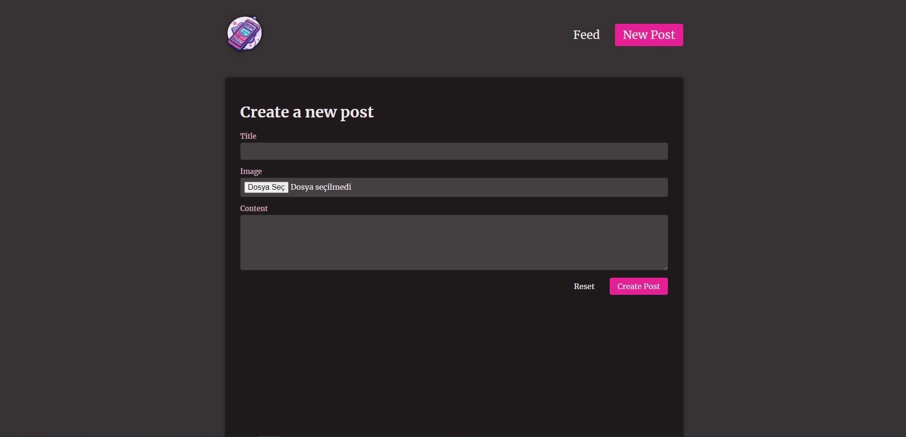

# nextPost

This project is a web application developed using Next.js. It includes data mutations, various hooks, and Cloudinary integration as part of modern web development practices.

## Features

- **Next.js**: A React-based framework.
- **Data Mutation**: Server actions are used for handling data mutations.
- **Hooks**:
  - `useOptimistic`: A hook for optimistic data updates. Learn more at [useOptimistic](https://example.com/useOptimistic).
  - `useFormState`: A hook for managing form state. Learn more at [useFormState](https://example.com/useFormState).
  - `useFormStatus`: A hook for handling form submission status. Learn more at [useFormStatus](https://example.com/useFormStatus).
- **Cloudinary**: Cloudinary is used for handling cloud storage and image processing.

## Getting Started

To get started with the project, follow these steps:

1. **Clone the repository**:

   ```bash
   git clone https://github.com/yourusername/nextPost.git
   cd nextPost
   ```

2. **Install dependencies**:

   ```bash
   npm install
   ```

3. **Set up environment variables**:
   Create a `.env.local` file in the root directory and add your environment variables. For example:

   ```plaintext
   CLOUDINARY_URL=your-cloudinary-url
   NEXT_PUBLIC_API_URL=your-api-url
   ```

4. **Run the development server**:

   ```bash
   npm run dev
   ```

   Open [http://localhost:3000](http://localhost:3000) with your browser to see the result.

## Learn More

To learn more about Next.js, take a look at the following resources:

- [Next.js Documentation](https://nextjs.org/docs) - learn about Next.js features and API.
- [Learn Next.js](https://nextjs.org/learn) - an interactive Next.js tutorial.

You can also check out the following documentation for the hooks used in this project:

- [useOptimistic Documentation](https://react.dev/reference/react/useOptimistic)
- [useFormState Documentation](https://pl.react.dev/reference/react-dom/hooks/useFormState)
- [useFormStatus Documentation](https://react.dev/reference/react-dom/hooks/useFormStatus)

## Contributing

If you would like to contribute, please open an issue or submit a pull request. We welcome all contributions.

## License

This project is licensed under the MIT License.
